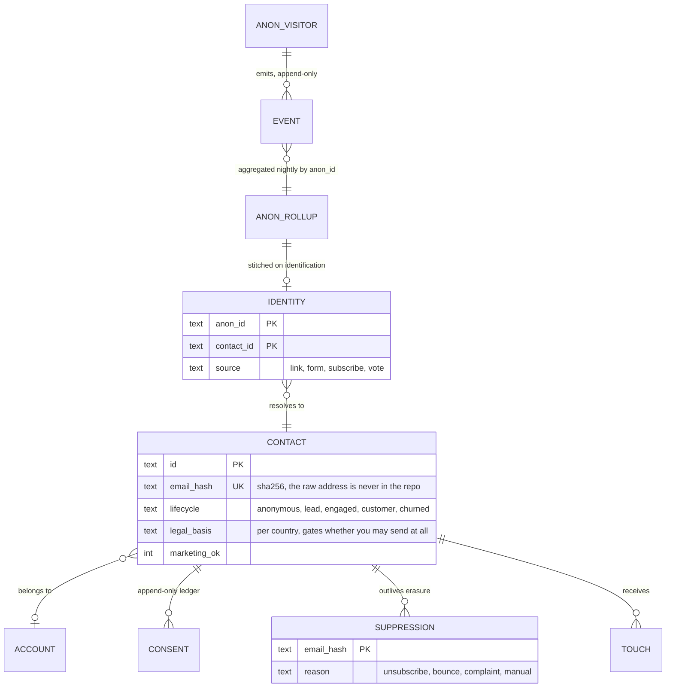

# A first-party CRM on Cloudflare's free tier

A content site gives its audience away by default. Someone reads forty pages,
downloads a route, comes back in March, and you know none of it, because the
knowing lives in Google Analytics and in a mailing list that starts the day
they type an address.

This is the architecture I use instead, running on Workers, D1, Analytics
Engine, KV and Cron Triggers, at zero monthly cost while traffic grows. It is
in production behind a 3,449-page site. What follows is the design, the schema,
and the two mistakes that cost the most.

It is the behaviour layer of a larger architecture, built before there was any
business model to justify it. The reasoning for that order is here:
[Designing for Optionality](https://smartsales.ai/en/writing/designing-for-optionality/).

## The axiom: two loads, two stores, never mixed

The single most important decision, and the one that is easiest to get wrong on
a free tier.

| Stream | What it is | Where it goes | Why |
|---|---|---|---|
| **Firehose** | Every page view, click, download. Anonymous, high cardinality, append-only, grows with traffic | Analytics Engine | Per-event rows would exhaust the database write budget somewhere in the first tens of thousands of visits |
| **System of record** | Contacts, accounts, identities, consents, touches. Mutable, relational, tens of thousands of rows | D1 | This is the base you actually own, and it has to be queryable |

A nightly cron reads the firehose grouped by anonymous id and updates the
record store. No visitor event ever writes a row directly. If you remember one
thing from this repository, remember that events and records are different
animals and want different homes.

## Identity is stitched backwards

Every device carries a persistent anonymous id. Everything anonymous is keyed
by it. When the person identifies themselves - a form, a subscription, a click
from a tracked link - one row links that anonymous id to a contact, and the
next rollup attributes their **entire prior history** to them.

That retroactive stitch is the asset. A list of email addresses is not a moat.
A journey that started four months before the address existed is.

## Consent and erasure are separate on purpose

Three decisions that are cheap on day one and expensive to retrofit:

**Consent is an append-only ledger, not a boolean on the contact.** The
question is never "may we email this person", it is "on what basis, since when,
and where is that recorded". A boolean cannot answer an audit.

**Suppression is keyed by the hash of the address, not by the contact.** A
right-to-erasure request then deletes the contact completely while the person
stays suppressed forever. With suppression stored on the contact row, honouring
erasure means forgetting that they asked never to be contacted again.

**Legal basis is per country.** The sending gate reads it. One policy applied
everywhere is either illegal somewhere or uncompetitive everywhere.

## The mistake that cost the most: read amplification

A measured incident, because the numbers are more useful than the moral.

The database was reading **6.5 to 8 million rows per day**. The largest table
in it held **10,040 rows**. Reads ran at roughly 1,000 to 1,500 queries per day,
which works out to about **6,200 rows per query**: every query was scanning
entire tables.

The free daily read allowance is 5 million rows, so this was 130 to 160% of the
limit, on a database of 16 MB with a few thousand writes a day.

Two things were wrong at once, and both are worth internalising:

1. **The problem was missing indexes, not scale.** Nothing about a 10,000-row
   table justifies eight million reads. Admin and analytics queries had no
   index to use, so SQLite did the honest thing and read everything.
2. **The metric to watch is rows read, not database size or write count.** Size
   and writes were nowhere near any limit and told us nothing. Rows read was
   the number that was quietly on fire.

The fix is indexes matched to the queries that actually run, not a bigger plan.

## Excluding your own traffic

Your own browsing pollutes the base worse than bots do, because it looks
exactly like a highly engaged user. Two mechanisms: a hash of the operator's
addresses on the edge, and an opt-out cookie for a logged-out browser. Without
this, the first "power user" cohort you discover is yourself.

## What is in this repository

- [`schema.sql`](schema.sql) - the record store: accounts, contacts,
  identities, consents, suppression, touches, and the anonymous rollup, with
  the indexes that keep reads off the floor. No data, no keys.
- [`docs/outreach-engine.md`](docs/outreach-engine.md) - the daily outreach
  engine built on this store: architecture, a day in its life, the rails and
  the incident behind each one, and the roadmap.
- [`docs/outreach-engine-setup.md`](docs/outreach-engine-setup.md) - the
  step-by-step setup in plain language: Google Workspace mailboxes (grant or
  buy), DNS, warm-up, installing the senders, the pilot, and what it costs.
- [`docs/outreach-engine-build-prompt.md`](docs/outreach-engine-build-prompt.md) -
  the same engine as a phased spec for Claude Code or Cursor, plus the research
  brief that fills it with contacts.

## What is not here

The letters themselves, the contact lists, anything resembling customer data,
and the site's own configuration. The point of publishing this is the
architecture, not the address book.
