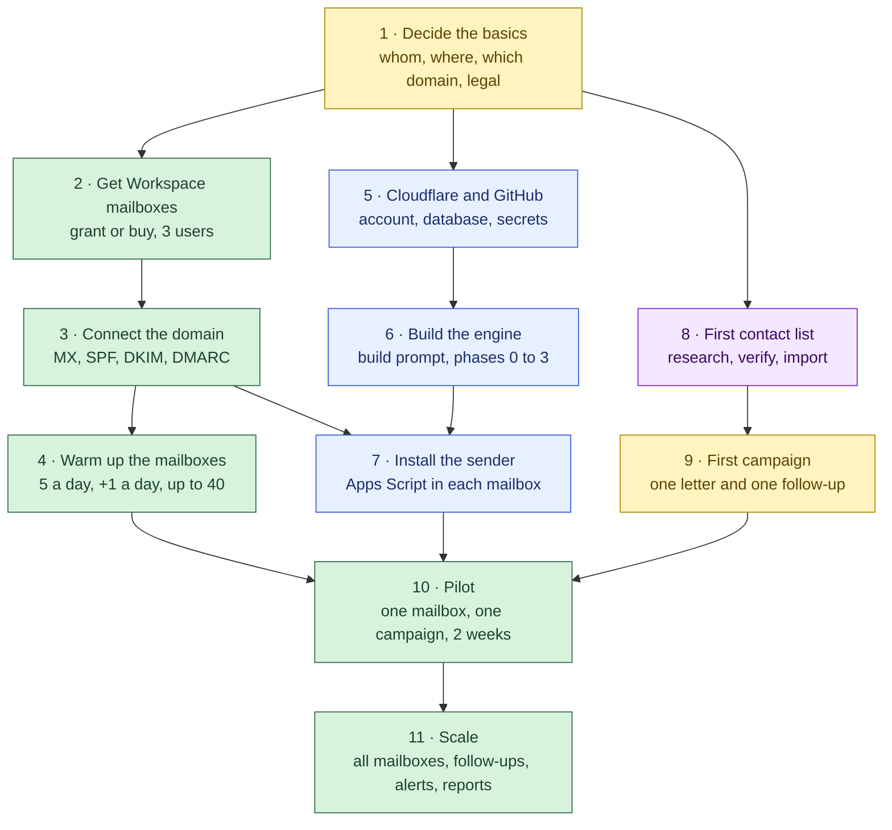

# Setting up the outreach engine, step by step

This is the practical roadmap: what to buy, what to switch on, what to install
and in which order, from nothing to the first letter. It is written for whoever
does the setup, whether that is a founder, an operations person or a
developer. Technical detail appears only where a step cannot be done without
it.

- **How it works and why:** [`outreach-engine.md`](outreach-engine.md).
- **What the developer hands to Claude Code or Cursor:**
  [`outreach-engine-build-prompt.md`](outreach-engine-build-prompt.md).

## What you end up with

- **Three mailboxes on your own domain.** Every weekday morning, each one sends
  a small batch of personal letters: 5 a day at first, rising to 40.
- **Letters that behave like a person.** Each is written for one
  organisation, in its language, and asks one question.
- **Follow-ups that stop themselves.** A follow-up goes out a few days later,
  but only if nobody clicked, answered or asked to stop.
- **Two emails a day to you.** At 08:00 you see what is about to go out, and
  can stop it. At 10:15 you see what actually went.
- **An alarm that comes early.** If the morning is going to fail, you hear
  about it at 03:45, while there is still time to fix it.

**Running cost:** about €25–30 a month. See [Costs](#costs).

## Who does what

| Role | Does | Time |
|---|---|---|
| **Owner** | decides whom to write to, writes the letters, reads the morning emails, answers replies | 15 minutes a day once it runs |
| **Developer** | sets up Cloudflare and GitHub, builds the engine with Claude Code, installs the scripts | most of weeks 1–4, then a few hours a month |
| **Researcher** (can be the owner) | builds the contact lists with Claude and checks them | a few hours per list |

## The roadmap at a glance

Yellow steps are the owner's, blue are the developer's, purple are research,
and green are done together. There are three tracks that run in parallel and
meet at the pilot:

- mailboxes and warm-up;
- the engine;
- lists and letters.

The warm-up takes about three weeks whatever you do, so start it on day 3.

| Week | Mailboxes | Engine | Lists and letters |
|---|---|---|---|
| **1** | buy or apply for Workspace, connect the domain, start the warm-up | Cloudflare and GitHub, build phases 0–2 | decide segments, first research run |
| **2** | warm-up continues | phase 3, install the sender in one mailbox | verify and import the first list, write the first letter |
| **3** | warm-up continues | phases 4–5 (replies, opt-outs, follow-ups) | **pilot starts:** one mailbox, one campaign |
| **4** | all three mailboxes warm | phases 6–7 (more mailboxes, alarms, daily report) | pilot review, second segment |
| **5+** | — | phase 8 (reports) | steady rhythm, see [Living with it](#living-with-it) |

This plan is indicative, for one developer working with Claude Code. The
warm-up is the part you cannot compress.

---

## Step 1. Decide the basics

*Owner · day 1 · about an hour, plus a conversation with a lawyer*

Write down the answers before anything is bought.

1. **Whom you write to.** Name the types of organisation (for example town
   halls, universities, hotels), the countries, and the language of the
   letters in each country.
2. **Which domain the letters come from.**
   - **Your main domain** is what we do. Recipients see the name they will
     find on your website, and replies arrive where you work. The risk: if you
     damage its reputation, your ordinary mail suffers too.
   - **A separate, similar domain** (for example `getbrand.com` next to
     `brand.com`) protects your main mail, but it looks less familiar and needs
     its own website or redirect.
   - At tens of letters a day, written one by one, the main domain is fine. If
     you plan hundreds a day, use a separate one.
3. **Who the owner is.** This is the person who receives the alarms and the
   daily report, and who answers the replies.
4. **The legal side, per country.** Ask a lawyer three things:
   - on what legal basis you may write to these organisations;
   - what the opt-out line must say;
   - what the signature must contain (company name, tax number, address).

   The engine enforces whatever you decide. It does not decide for you.

## Step 2. Get Google Workspace mailboxes

*Owner · days 1–3*

**Route A: a grant.**

- Registered charities can get **Google Workspace for Nonprofits** free,
  through [Google for Nonprofits](https://www.google.com/nonprofits/offerings/workspace/).
- Verification is done by a partner (Goodstack) and takes a few working days.
- Apply first, then set up Workspace. A normal paid trial does not convert
  into the free edition.
- Companies, government bodies and schools are not eligible; schools have
  their own Education edition.
- If you are in a startup or accelerator programme, check whether it includes
  Workspace credits.

**Route B: buy it.**

- **Business Starter** is enough. In September 2026 the list price was about
  **€6.80 per user per month** on an annual plan, and Google often runs
  introductory discounts.
- Check the [current price](https://workspace.google.com/pricing) when you buy.

**How many mailboxes: start with three.**

- Every mailbox must be a **real user (a paid seat)**, not an alias.
- An alias is only another name for the same mailbox. It shares that
  mailbox's daily sending limit, its reputation and its inbox, so it adds
  nothing.
- Name the mailboxes after people or clear roles, for example `anna@`,
  `team@`, `partners@`. Avoid names that look automated, like `noreply@` or
  `outreach1@`.

**Set up each mailbox like a person's:**

- display name, photo and a signature;
- 2-step verification switched on.

**Skip consumer Gmail** (`@gmail.com`) for this:

- Apps Script lets a consumer account send to only 100 recipients a day.
- It cannot sign mail with your domain.
- Our own consumer warm-up mailbox ended up with 45% of its letters in spam.

## Step 3. Connect the domain to Google

*Whoever controls the domain's DNS (often the developer) · 1–2 hours, then up to 48 hours to take effect*

The Workspace setup wizard shows the exact records. Here is what each one is
for and what to watch out for.

| Record | What it does | How |
|---|---|---|
| **MX** | tells the world that mail for your domain goes to Google | copy the MX records from the Workspace wizard. **If the domain uses Cloudflare Email Routing, switch it off first**, because the two conflict. We moved replies from Email Routing to a Workspace mailbox in September 2026. |
| **SPF** | lists who may send mail as your domain | one TXT record on the domain: `v=spf1 include:_spf.google.com ~all`. A domain may have only **one** SPF record, so if one exists, add Google to it rather than creating a second. |
| **DKIM** | signs every letter, so it cannot be faked | Admin console → Apps → Google Workspace → Gmail → **Authenticate email** → generate a 2048-bit key → add the TXT record it shows (`google._domainkey`) → go back and press **Start authentication**. |
| **DMARC** | tells receivers what to do with mail that fails SPF or DKIM, and sends you reports | TXT record at `_dmarc`: `v=DMARC1; p=none; rua=mailto:dmarc@yourdomain`. After 2–4 weeks of clean reports, change `p=none` to `p=quarantine`. |

**How to check it worked:**

1. Send a letter from each new mailbox to a personal Gmail address.
2. In Gmail open **⋮ → Show original**. You want **SPF: PASS**, **DKIM: PASS**
   and **DMARC: PASS**.
3. Optionally, send one letter to a checker such as mail-tester.com.

**Why this matters:** Gmail and Yahoo have required SPF, DKIM and DMARC from
bulk senders since 2024. At tens of letters a day you are not a bulk sender,
but without these records you land in spam anyway.

## Step 4. Warm up the mailboxes

*Owner, with the engine's help once it runs · weeks 1–3 · starts as soon as step 3 passes*

A new mailbox has no reputation. Mail providers watch how it behaves: whether
people open its letters, answer them, or mark them as spam. The first weeks
decide where your letters land for months.

- **Start small.** Send 5 letters on day 1 and one more each day, up to 40.
  The engine keeps this ramp for each mailbox automatically, but only once it
  runs, and until then you do it by hand.
- **Write to people who will answer.** Partners, existing contacts,
  colleagues, friendly organisations. We warmed our mailboxes with real letters
  to contacts likely to reply, not with a "warm-up service".
- **Answer, and get answered.** Keep real conversations going from each
  mailbox. If a letter lands in someone's spam, ask them to move it to the
  inbox.
- **Watch two numbers.** Bounces (addresses that do not exist) must stay under
  2%. Spam complaints must stay at zero.
- **Warm each mailbox separately.** Reputation is per mailbox, and one bad
  mailbox should not drag down the others. That is why every mailbox in the
  engine has its own ramp and its own sender.

## Step 5. Cloudflare and GitHub

*Developer · days 3–5 · 2–3 hours*

1. **A Cloudflare account**, with the domain's DNS on Cloudflare. This is not
   required, but it is simplest, because the engine gets its own address such
   as `crm.yourdomain`.
2. **The Workers Paid plan, $5 a month.** The free plan has a daily database
   read limit. When it was hit, it switched off every read until midnight UTC:
   the send queue, the replies, the forms. It happened to us once, and $5 a
   month is the cheapest insurance in this document.
3. **A D1 database**, created in the Cloudflare dashboard or with
   `wrangler d1 create`. This is where contacts, the send queue and the
   history live.
4. **A private GitHub repository** for the engine, with two Actions secrets:
   - `CLOUDFLARE_API_TOKEN`, a token with permission to edit Workers and D1;
   - `CLOUDFLARE_ACCOUNT_ID`.
5. **One engine secret:** `RUN_TOKEN`, a long random string (for example the
   output of `openssl rand -hex 24`). The mailbox scripts use it to talk to
   the engine. Keep it out of git and out of chat.

## Step 6. Build the engine

*Developer with Claude Code or Cursor · weeks 1–4*

Follow [`outreach-engine-build-prompt.md`](outreach-engine-build-prompt.md).
Fill in its section 0 with the answers from step 1, then build **one phase per
session** and review each report before starting the next.

| Phases | What you have after them |
|---|---|
| 0–2 | a deployable, empty engine; contact lists can be imported |
| **3** | **one mailbox can send one campaign, with a human checking every morning.** This is the minimum for the pilot |
| 4–5 | replies, bounces and opt-outs are handled automatically, and follow-ups run |
| 6–7 | several mailboxes, the night-time alarm, the daily report |
| 8 | per-campaign results without writing SQL |

Two rules the developer must not bend:

- **Deploys go through GitHub Actions only, never from a laptop.**
- **Nobody deploys between 08:45 and 10:15 UTC.** That is the sending window,
  and changing the rules while mailboxes are sending has cost us a day.

## Step 7. Install the sender in each mailbox

*Developer or owner, logged in as that mailbox · 15 minutes per mailbox*

The sender is a small Google Apps Script. It fetches the letters the engine
wrote, sends them from the mailbox, and reports back. It makes no decisions.

1. Log into the mailbox, open **script.google.com**, then **New project**.
2. Paste the sender file from the engine's `apps-script/` folder.
3. **Project Settings → Time zone → (GMT+00:00) UTC.**
   - The engine enforces the sending window itself, but a wrong time zone here
     once made our scripts fire at 06:00 UTC, before the recipients' offices
     opened.
4. **Project Settings → Script properties:**
   - `TOKEN` is the `RUN_TOKEN` from step 5;
   - `BOX` is this mailbox's name as the engine knows it;
   - `BASE_URL` is the engine's address.
5. **Triggers** (the clock icon):

   | Function | Trigger | Why |
   |---|---|---|
   | `send` | Day timer, 9–10 am | sends today's batch |
   | `digest` | Day timer, 8–9 am | emails you the batch before it goes |
   | `harvest` | Minutes timer, every 10 minutes | brings in replies, opt-outs and bounces |
   | `sendOutbox` | Minutes timer, every 5 minutes, **in one mailbox only** | alarms and form replies |

   If the trigger dialog shows a time zone other than UTC, it is using your
   account's zone, so shift the hours to match.
6. **Run it once by hand:** choose `digest`, then **Run**.
   - Google warns that "this app isn't verified". It is your own script, so
     choose **Advanced → Go to project → Allow** to grant Gmail access.
7. Check that the digest email arrives.

**Limits you will not hit:** Apps Script may send to 1,500 recipients a day
from a Workspace account. The engine never goes above 40 per mailbox.

## Step 8. The first contact list

*Researcher with Claude · weeks 1–2 · a few hours*

1. **Pick one segment in one region for the pilot.** 50 to 100 organisations
   is plenty.
2. **Check what you already hold** (the coverage script), so the research does
   not pay for rows you have.
3. **Run the research brief**, Prompt B in the build prompt.
   - Run it in its own Claude session.
   - For long lists, use one small agent per source, not one big "deep
     research" run. The big run is good at explaining, bad at listing: on one
     of our lists it returned nothing where the per-source approach returned
     303 rows.
4. **Verify every address on its page.** A model saying "verified" is not
   proof. About 5% of such addresses were not on the page when we checked.
   The verify script fetches the page and looks for the exact address.
5. **Check the domains exist** with the DNS script. Before we did this, up to
   8% of first letters bounced.
6. **Import.** The developer runs the import. It is safe to run twice.

## Step 9. The first campaign

*Owner · week 2 · an afternoon*

Write **one first letter and one follow-up**. What worked for us:

- **The recipient's language**, plain text, short.
- **Open with them, not with you.** A fact about their town, their
  institution or their numbers, and a question.
- **One link, one question, one ask.**
- **An opt-out line in their language**, with the exact word to reply, for
  example "reply *stop*". The engine must recognise that word in replies;
  the developer adds a test for it.
- **A signature** with a real name and the legal details from step 1.
- **A follow-up 5–7 days later.** It is shorter, adds something new, and does
  not repeat the pitch.

The developer turns the letters into a template. The next morning's digest
shows you exactly what each recipient will get.

## Step 10. The pilot

*Owner and developer · weeks 3–4 · one mailbox, one campaign*

Every morning:

- **08:00–09:00:** the digest arrives. Read it. If a letter is wrong, ask the
  developer to pause that row. A paused row never goes out on its own.
- **09:00–10:14:** the mailbox sends. On the first day of any new campaign it
  sends only **3 letters**, so a mistake costs three letters, not thirty.
- **10:15:** the daily report. Its subject line tells you the result:
  "42/45 sent" or "NOTHING SENT".
- **During the day:** answer every reply yourself, the same day. When you take
  over a conversation, the contact is marked "manual" and the engine stops
  writing to them.

**The pilot is done when all of these are true:**

- two weeks without an incident;
- bounces under 2%;
- no spam complaints;
- replies are coming in. Judge the pilot on replies, not on opens.

## Step 11. Scale

*From week 4*

Add one thing at a time, and wait a week between additions:

1. the other two mailboxes, each with its own warm-up ramp;
2. follow-ups for the pilot campaign;
3. a second segment or country;
4. the night-time alarm (03:45) and the pre-send check (08:30), if they are not
   on already.

Do not add volume faster than the ramp. Do not start a new segment in its
holiday month: we learned that town halls in August read nothing, and a test
run then tells you nothing.

---

## Living with it

| How often | What | Who |
|---|---|---|
| **Daily**, 5 minutes | read the 08:00 digest and the 10:15 report, answer replies | owner |
| **When an alarm arrives** | it names the mailbox and the reason; the developer fixes it before 09:00 | developer |
| **Weekly** | look at the send log (planned vs sent, and why letters were held back); plan the next list | owner and developer |
| **Monthly** | read the DMARC reports; re-check contacts older than about 4 months (lists go stale in 3–6); retire campaigns that stopped getting replies | developer and researcher |

## Costs

Prices were checked in September 2026 and change often.

| Item | Monthly |
|---|---|
| Google Workspace Business Starter, 3 users | ≈ €20 (free with the nonprofit grant) |
| Cloudflare Workers Paid | $5 |
| Domain (only if you buy a new one) | ≈ €1–2 (€10–20 a year) |
| Apps Script, GitHub, the D1 database within the plan | €0 |
| Claude, for research and Claude Code | your existing plan |
| **Total** | **≈ €25–30** |

## What goes wrong in the first month, and what to do

| You see | Likely cause | Do |
|---|---|---|
| Letters land in spam | DNS records missing, or the mailbox is too new | re-check step 3 ("Show original"), slow the ramp, send more letters to people who answer |
| The 10:15 report says "NOTHING SENT" | a trigger fired outside the window, a template broke, or a deploy went wrong | the report and the 03:45 alarm name the mailbox and the reason. Fix it before the next window |
| Many bounces | the list was not verified or not DNS-checked | stop that list, run steps 8.4–8.5 again |
| Someone replies "stop" and still gets a letter | their opt-out word is not recognised | pause them by hand at once, and have the developer add the word and a test for it |
| An email says "outside the send window" | the trigger's time zone is wrong | set the project time zone to UTC (step 7.3) and move the trigger |
