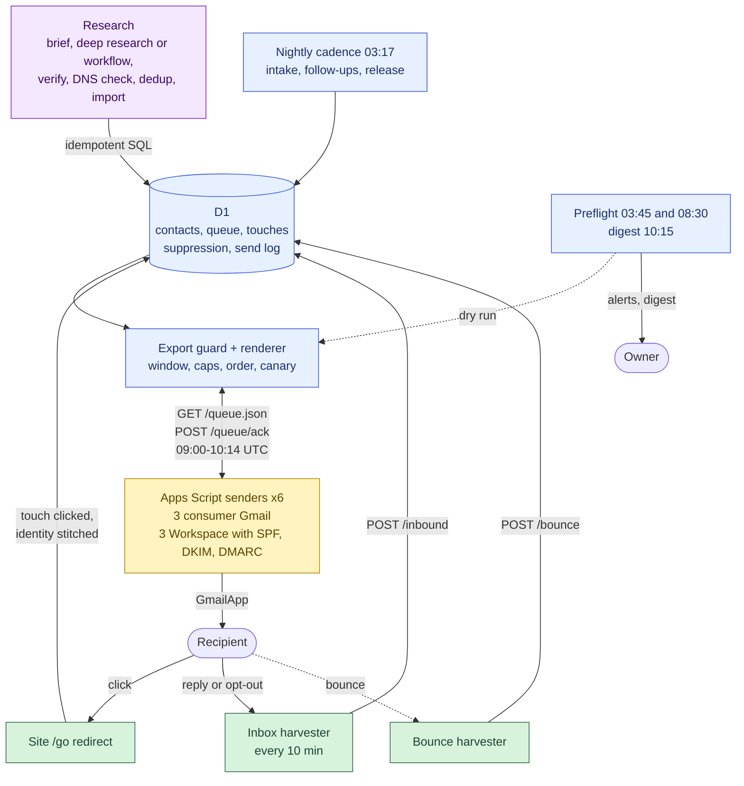
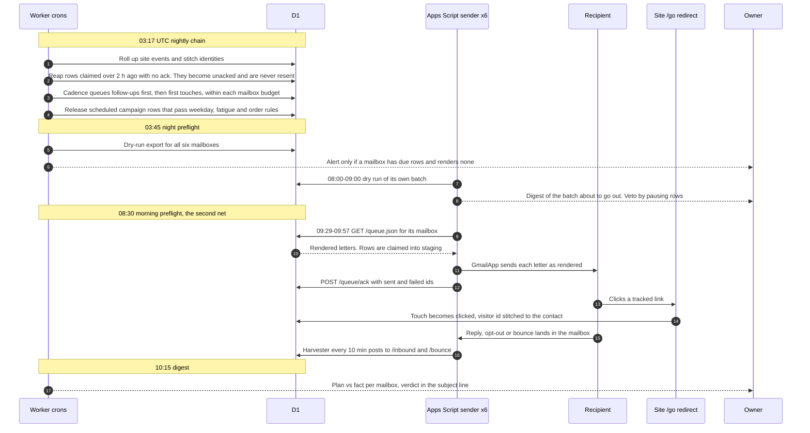
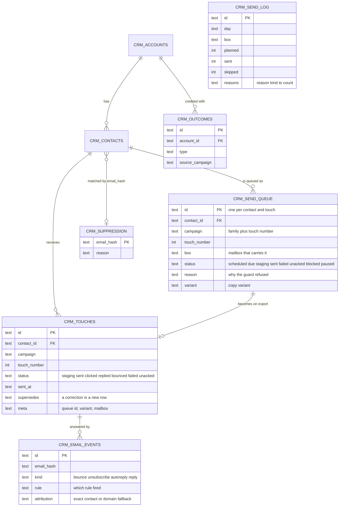
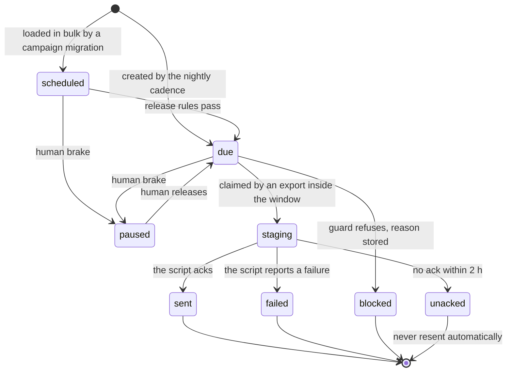
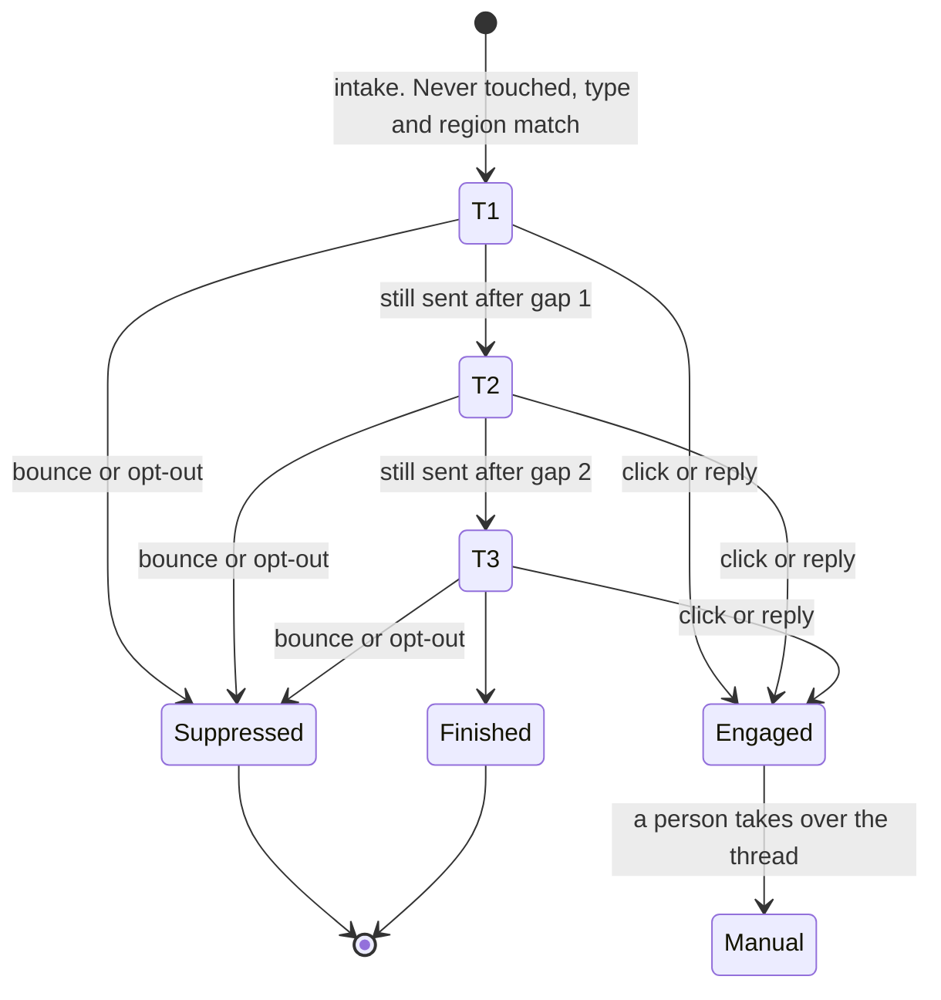
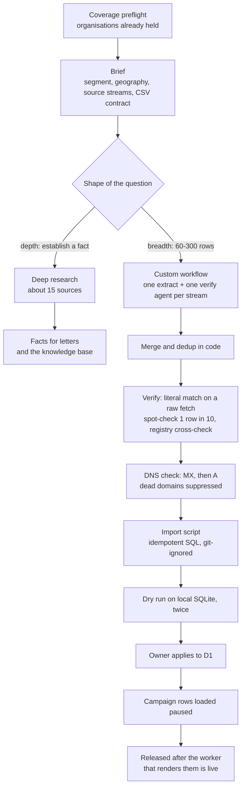
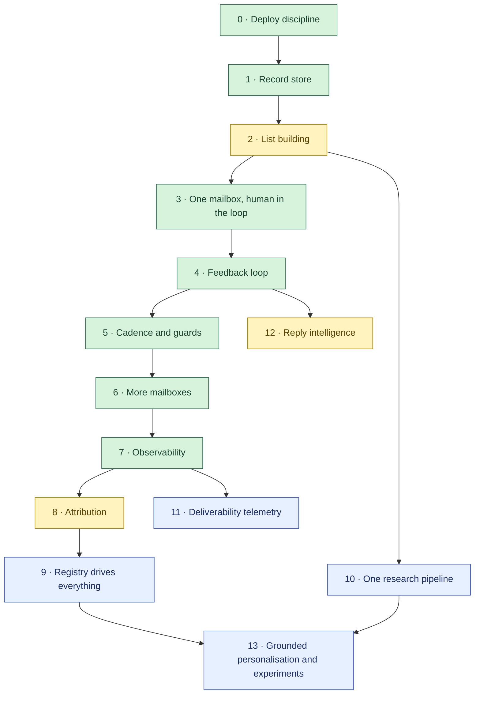

# The outreach engine

This is how the daily outreach runs on top of the record store in this
repository. It covers who gets which letter, when, from which mailbox, and what
happens to the answer. The engine has been in production since July 2026 and
fully automated since August. It writes to public-sector bodies, universities,
media and hotels in two countries and two languages, from six mailboxes, in a
single send window every morning.

> **In plain words.**
>
> - **Every weekday morning, six of our mailboxes each send a small batch of
>   personal letters:** tens, not thousands.
> - **A small program on Cloudflare does the thinking.** It decides who gets
>   which letter, writes it, and checks that it is safe to send. The mailboxes
>   only press "send".
> - **It stops when people react.** When someone clicks a link, replies,
>   bounces or asks us to stop, the program notices and stops writing to them.
> - **The owner hears about it every day.** A short report arrives every
>   morning. If the morning is about to go wrong, a warning arrives in the
>   night, while there is still time to fix it.
> - **The lists come from research.** We build them with Claude, and every
>   address is checked on its source page before it is used.

This repository has three documents about the engine:

| Document | For whom | What it is |
|---|---|---|
| **this one** | anyone who wants to understand the engine | how it works, why it is shaped this way, and the roadmap |
| [`outreach-engine-setup.md`](outreach-engine-setup.md) | whoever sets it up | the practical roadmap in plain language: get the mailboxes, connect the domain, warm up, install, pilot, scale |
| [`outreach-engine-build-prompt.md`](outreach-engine-build-prompt.md) | the developer | a phased spec to hand to Claude Code or Cursor |

## The shape in one sentence

**The worker is the brain. The mailbox is a dumb pipe.**

| Part | Its only job | Runs on |
|---|---|---|
| **Research** | turn "who should hear from us" into verified rows | Claude deep research, custom extract-and-verify workflows, import scripts |
| **Brain** | decide who gets which letter today, render it, refuse anything unsafe | one Cloudflare Worker, D1, Cron Triggers |
| **Transport** | send exactly what the brain rendered, then confirm it | Google Apps Script, one project per mailbox |
| **Feedback** | turn clicks, replies, bounces and opt-outs back into state | a tracked redirect on the site, an inbox harvester, a bounce harvester |

**Why Gmail and not an email service provider?** A letter to a town hall or a
university department is one-to-one and low volume. It is judged by whether
someone answers, not by open rate. A real mailbox delivers the way a person
does, puts the reply in a human inbox, and costs nothing.

The price is that Apps Script is a poor scheduler:

- triggers fire minutes late;
- the project's time zone belongs to whoever created it, and it silently moves
  back when someone edits the project;
- quotas are per account.

So nothing that matters is decided in the script. The window, the caps, the
order of letters, the copy and suppression all live in the worker, where they
are versioned, tested and visible.

## Contents

1. [Architecture](#1-architecture)
2. [A day in the life](#2-a-day-in-the-life)
3. [Data model](#3-data-model)
4. [Lifecycles: a queue row and a contact](#4-lifecycles)
5. [Upstream: from research to a mailable row](#5-upstream-from-research-to-a-mailable-row)
6. [Rails, and the incident behind each](#6-rails-and-the-incident-behind-each)
7. [What the numbers taught](#7-what-the-numbers-taught)
8. [Roadmap](#8-roadmap)
9. [What is still not here](#9-what-is-still-not-here)

## 1. Architecture

Purple is research, blue is the brain, yellow is transport, green is feedback.

What the diagram does not show:

- **The worker is standalone, not a Pages Function.** Cron triggers and inbound
  mail handlers need a real Worker. It shares the site's D1 database through a
  binding.
- **There are six mailboxes.** Three are consumer Gmail accounts, the first
  pilots. Three are Google Workspace mailboxes on the sending domain; they sign
  with SPF, DKIM and DMARC and need no Reply-To trick.
- **Each mailbox has exactly one sender script.** Two senders on one mailbox add
  their caps together without either one knowing.
- **The Workspace mailboxes share one script file.** A Script property names
  the mailbox's lane. The script holds a token, a base URL and nothing else.
- **Transactional mail has its own endpoint.** Form auto-replies and owner
  alerts go through `/outbox.json`, drained every five minutes, so an alert
  never waits for tomorrow's window.

## 2. A day in the life

| UTC | What | Why at this time |
|---|---|---|
| 03:17 | nightly chain: rollup → reap unacked → cadence → enrichment → snapshots → attribution | off the hour, to dodge cron contention |
| 03:45 | night preflight: a dry-run export for every mailbox | leaves five hours to fix code and redeploy |
| 08:00–09:00 | each script mails the owner a dry run of its batch | a human can veto by pausing rows |
| 08:30 | morning preflight | the second net. The 03:45 run cannot see rows released late |
| 08:45–10:15 | deploy freeze | a deploy at 09:06 once changed the rules under two mailboxes that had already pulled |
| 09:00–10:14 | send window, enforced by the queue, not the trigger | triggers sit at fixed minutes from 09:29 to 09:57. Google fires them late often enough that a one-hour window lost whole days |
| every 10 min | inbox harvester posts new mail | replies and opt-outs take effect the same morning |
| 10:15 | digest: plan vs fact per mailbox, verdict in the subject | goes out every day, good or bad. A digest that only goes out on success is silent exactly when something broke |
| every 30 min | D1 budget guard | see the read-amplification story in the [README](../README.md) |

## 3. Data model

The record store (accounts, contacts, identities, consents, suppression) is in
[`schema.sql`](../schema.sql). Outreach adds the queue and the ledgers around it.

| Table | What it holds | The rule that matters |
|---|---|---|
| `crm_send_queue` | every letter the engine intends to send, one row per contact and touch | ids are deterministic, so re-running the cadence is a no-op |
| `crm_touches` | every letter that left, and what came back | append-only, enforced by a trigger. A correction is a new row that points at the one it supersedes, never an edit or a delete |
| `crm_send_log` | plan vs fact per mailbox per export call, with the reasons for every refusal | without it, "nothing went" and "not everything went" cannot be told apart after the fact |
| `crm_email_events` | each inbound message and the rule that classified it | a misclassification is debuggable without a manual audit |
| `crm_suppression` | opt-outs, bounces and dead domains, keyed by address hash | survives the erasure of the contact |
| `crm_outcomes` | conversions and backlinks credited to the touch before them | the only honest measure of a campaign |
| outbox | transactional mail and owner alerts | a plain insert, so the alert channel keeps working in an incident |
| `crm_meta` | key-value store: sender identity, cursors, alert stamps, cached values | the send path never fetches anything live that it could have cached |

## 4. Lifecycles

### A queue row

- **The guard parks some rows and holds others.** A refusal on order,
  duplicate or manual ownership parks the row as `blocked`. A refusal on
  cooldown or canary leaves it `due` for tomorrow. Both are counted in the send
  log with their reason.
- **Delivery is at-most-once by design.** A letter that may have gone is never
  sent again automatically. Losing a letter costs one touch; sending it twice
  costs the account.
- **Two export modes exist today.** Newer families claim rows into `staging`
  and wait for the script's ack. Older families are marked sent the moment the
  export is read. The second mode can record a letter that never left if the
  script dies mid-batch; moving everything to claim-and-ack is on the roadmap.
  In the code the confirmed state is called `staged`.

### A contact

- **"No engagement" is never computed.** A follow-up fires only if the previous
  touch is still `sent` once the gap has passed. A click, a reply or a bounce
  changes that status, and the sequence stops by itself.
- **Gaps in production are set per family.** T2 and T3 follow at 4 and 10 days
  for clubs, 5 and 12 for media, 7 and 14 for organisations, and 5 and 7 for the
  public-sector wave.
- **The third touch is off.** It sits behind a kill switch and is currently
  switched off everywhere.
- **Manual contacts are invisible to the engine.** A contact marked `manual` is
  refused by every export: once a person owns the thread, the machine stays
  out of it.

## 5. Upstream: from research to a mailable row

The rules, each learned the hard way:

1. **Run a coverage preflight before the brief.** A script prints the
   organisations already held in the target region, and the brief pastes that
   list in. Without it, one pass spent 21% of its output on organisations we
   already had. In one region the figure was 77%.
2. **Pick the tool by the shape of the question.**
   - *Depth*, meaning establish one fact against many sources, suits deep
     research.
   - *Breadth*, meaning enumerate hundreds of organisations, needs a custom
     workflow: one extract agent and one verify agent per source stream, a
     shared rules string, and deduplication in plain code.
   - On one enumeration brief, the generic deep-research tool returned zero
     rows. The custom workflow returned 303 rows from 32 streams.
3. **Give wide fan-outs their own session, on a model you can afford to fan
   out.** A 20-agent run on the most expensive model hit session limits on 19
   of 20 agents and returned nothing.
4. **Use one CSV contract:**
   `type,name,email,website,country,region,city,contact_role,source_url,notes`.
   `region` comes from a closed list, and doubtful rows are kept and tagged
   `LOW-CONFIDENCE`.
5. **An address counts as verified only if it is on the page.** That means a
   literal string match on a raw fetch, not a model saying it saw it; about 5%
   of rows marked verified failed this test.
   - Spot-check at least 10% of rows, and widen the sample on the first miss.
   - Aggregator sites invent plausible addresses: 4 of 13 were wrong in one
     batch. Official registries beat them.
6. **Check DNS before the first send.** Check syntax, then MX, then A records.
   Never probe over SMTP. Before this check, first-touch bounce rates ran at
   7–8% against a 2% bar.
7. **Deduplicate on the hash of the address, not the name.**
   - Most duplicates are born inside a single batch: 24 of 25 collisions were.
   - A shared mailbox listed for two roles collides on the unique hash. The
     import then "succeeds" with short counts. Give the address to one contact.
8. **Load paused, release after deploy.**
   - Imports write idempotent SQL to a git-ignored file. It runs twice on local
     SQLite, then the owner applies it.
   - Campaign rows go in `paused` or `scheduled`, and are released only once
     the worker that can render them is live.
   - A queue migration applied before its contacts exist is logged as done
     with zero rows and never runs again.
9. **Collect just ahead of need.** Contact data decays in three to six months.

## 6. Rails, and the incident behind each

Every rail below exists because something went wrong without it. The incidents
are listed because they explain the rails better than any principle does.

| Rail | What happened without it |
|---|---|
| **One send path.** Only the Apps Script mailboxes send. A worker-side SMTP transport was built, never used, then deleted. | A second transport bypasses the window, the caps, the canary and the preflight. A transport that can send around the rails eventually will. |
| **The send window lives in the queue, in UTC.** Outside it, the export returns an empty batch and the script alerts the owner. | The trigger said "9 to 10", but in the Apps Script project's time zone, which was not the recipients'. Letters went out at 06:xx UTC, before the town halls opened. |
| **The window is 75 minutes, not 60.** | The last trigger sat at 09:57. A Google delay of three minutes cost a whole day, and the only sign was silence. |
| **Claim, ack, at-most-once.** A claimed row without an ack becomes `unacked` after two hours and is never resent. | Families marked sent on read can record letters that never left when a script dies mid-batch. |
| **Reading is not claiming.** A dry run never mutates. | An early CSV export staged rows on a GET. One stray request burned a day of sends. |
| **Append-only touches, a `manual` flag, statuses named for what the machine does with them.** | 23 town halls received the farewell letter as their first touch, and 7 received the offer twice. |
| **A campaign registry that every consumer reads, plus a test that fails if a campaign is missing from any of them.** | A new campaign was added to the release SQL but not to the sender-identity gate. Six mailboxes released rows, every row failed to render, zero letters went out, and nothing raised an error. |
| **Preflight twice, at 03:45 and 08:30.** | With only 08:30 there were 30 minutes before the window. The fix took an hour and a half, and the day was lost anyway. |
| **CI gates the deploy on `/preflight.json` for all mailboxes.** | CI used to dry-run one mailbox, for which `messages=0` was normal. On the day all six answered exactly that, the deploy went green three hours before the day went to zero. |
| **The send log records plan vs fact, with reasons.** | A dry run answered `skipped=18`. The reason was only visible to someone watching the response live in that minute. |
| **Schema is checked against `sqlite_master`, not the migration ledger.** | The ledger was seeded from the folder and marked 61 files applied, including one written that day and never run. A required table was missing while the ledger said all was well. |
| **Migrations are applied in CI before the deploy.** | A new-country wave sent nothing for six days because its migration was not applied. |
| **Deploy only from CI. `/version.json` names the commit.** | A deploy from a stale copy of the repository silently deleted a live endpoint that a sender depended on. Another stale deploy sent the farewell letter instead of the warm-up for nine days. |
| **Deploy freeze around the window.** | The worker was deployed at 09:06, when two of six mailboxes had already pulled their batch. |
| **Every intake filters on account type, never on region alone.** | A club intake filtered by region only, so 135 non-club contacts got the cyclists' letter. That also sealed them out of their own campaign, because a follow-up matches the prior touch's campaign. |
| **Canary: a new campaign sends three letters before it sends thirty.** | No incident was needed for this one. It caps what any render bug can cost at three letters instead of a day. |
| **One sender per mailbox, one mailbox per reputation.** | One warm-up mailbox landed 45% of its mail in spam. The public-sector wave moved to its own mailbox so its reputation would not depend on another's. |
| **Autoreply detection before reply detection.** | Out-of-office messages counted as replies, flattering every campaign. |
| **Operator exclusion and a D1 read budget.** | See the [README](../README.md). |

## 7. What the numbers taught

**Segments behave differently in the same month.** These are click-through
rates on first touches before and after 25 July, measured on 8 August 2026:

| Segment | Before | After |
|---|---|---|
| academic | 34.7% | **46.9%** |
| tourist office | 13.1% | **23.1%** |
| regional body | 8.9% | 10.3% |
| media | 13.1% | 9.4% |
| town hall | 19.8% | **5.7%** |
| club | 4.3% | 1.6% |

Two consequences:

- **You get one first impression per town hall.** Spending it in the month
  nobody is at the desk wastes it. Intake skipped town halls until late
  August, while follow-ups to conversations already started kept going.
- **Seasonal tests read false.** A copy test on town halls run in August
  returns a false negative.

**The constraint moves to fresh contacts.** By early August, the three
best-converting segments were exhausted at first touch, and only about 300
fresh mailable contacts remained outside a stopped segment. From then on the
engine is a follow-up engine, research throughput becomes the bottleneck, and
the machine should be judged on replies rather than volume.

**Clicks, not opens.** Every link in a letter goes through a tracked redirect
carrying the campaign and account. A click flips the touch to `clicked`,
stitches the visitor to the contact, and brings the whole prior anonymous
journey with it. There are no open pixels.

## 8. Roadmap

Read the roadmap two ways. **As a build order:** stages 0–8 are the sequence in
which to build an engine like this from nothing, placed so that each stage has
the rails it needs before it runs. **As our status:** stages 9–13 are what our
engine does not do yet.

This is the engineering roadmap. For the practical, week-by-week setup (buying
the mailboxes, DNS, warm-up, installing the scripts, the pilot), see
[`outreach-engine-setup.md`](outreach-engine-setup.md).

Green is running in production, yellow is partly built, blue is not started.

| # | Stage | Build | Done when | Why at this position | Ours |
|---|---|---|---|---|---|
| 0 | **Deploy discipline** | CI-only deploys, `/version.json`, `/health`, migrations applied by CI and checked against the live schema, a deploy freeze around the window | a deploy from a laptop fails, and `/version.json` names the running commit | a stale deploy deleted a live endpoint, and another sent the wrong letter for nine days | ✅ |
| 1 | **Record store** | accounts, contacts, suppression by hash, a consent ledger, append-only touches | re-applying the schema is a no-op, and deleting a touch raises | everything later reads these | ✅ |
| 2 | **List building** | brief template, CSV contract, on-page verification, DNS check, dedup, idempotent import | one batch imported twice gives the same counts, and the spot-check is logged | the engine is only as good as its rows | 🟡 one importer per segment |
| 3 | **One mailbox, one campaign, a human in the loop** | registry, renderer, queue, claim-and-ack export, one Apps Script sender, the window in the queue, a dry-run digest | the dry run renders exactly what the send sends, and a killed script leaves rows `unacked`, not sent | prove the pipe before you widen it | ✅ (ack not yet everywhere) |
| 4 | **Feedback loop** | tracked redirect, inbox harvester, bounce harvester, classifier, suppression | a reply stops the sequence, an opt-out suppresses by hash, and an autoreply changes nothing | it must exist before follow-ups, or follow-ups mail people who said no | ✅ |
| 5 | **Cadence and guards** | follow-ups with gaps, guards for order, duplicates, manual ownership, cooldown and canary, a type guard on every intake | a later touch can never precede an earlier one, and a new campaign sends three letters first | follow-ups are where most of the value is, and where most of the damage is | ✅ |
| 6 | **More mailboxes** | mailbox routing, per-mailbox ramps and caps, Workspace on your own domain with SPF, DKIM and DMARC | each mailbox has one sender and respects its ramp | quotas and reputation are per mailbox | ✅ |
| 7 | **Observability** | send log, preflight twice, daily digest, `/preflight.json` gating CI, D1 budget guard, a cockpit | a day that would send zero letters raises an alert before the window, not after | silent zero-days were the most expensive failure we had | ✅ |
| 8 | **Attribution** | click → identity stitch → on-site journey, outcomes credited to the last touch, per-segment reports | per-campaign reply and click rates come without a hand-written query | you cannot steer what you do not measure | 🟡 |
| 9 | **Registry drives everything** | renderer choice, dates, regions, pauses and caps as data in D1 with an admin form, not constants in code; claim-and-ack for every family | adding a campaign touches one registry entry, and no family is marked sent on read | today a renderer is chosen by an order-sensitive if/else chain, and dates live in code | ⬜ |
| 10 | **One research pipeline** | one CSV contract, one importer, an automated coverage preflight, re-verification of contacts older than N months | a new segment needs a brief, not a new script | there are six CSV shapes and six importers today | ⬜ |
| 11 | **Deliverability telemetry** | bounce and complaint rates per mailbox, seed-list placement tests, DMARC aggregate reports, an automatic throttle on breach | a mailbox over 2% bounces pauses itself | the one spam-placement figure we have was found by hand | ⬜ |
| 12 | **Reply intelligence** | an LLM classifier on top of the rules: interested, not now, wrong person plus referral, opt-out, out of office; referral → new contact; human handoff with an SLA; an opt-out vocabulary per language, tested against every template | every template's opt-out word is recognised in a test, and a referral becomes a contact without a human | rules alone miss languages and nuance, and every reply is the scarcest thing the engine produces | 🟡 rules only |
| 13 | **Grounded personalisation and experiments** | a per-account fact sheet with provenance, rendered into letters; A/B tests with a holdout and a seasonality guard | every number in a letter traces back to a source row | per-account facts are hand-built for each campaign today, and August tests gave false negatives | 🟡 per campaign, by hand |

### What "next" means in practice

- **Stage 9 comes first.** It removes the two structural risks that remain:
  families marked sent on read, and a renderer chain whose order matters. It
  also removes the need for a code deploy to pause a segment or move a date.
- **Stage 11 comes before any volume increase.** Ramps and separate mailboxes
  are the only protection today, and nobody measures inbox placement
  continuously. The first sign of trouble should be a number, not a quiet week.
- **Stage 12 pays for itself first.** Replies are the scarcest output of the
  engine. A referral ("write to my colleague in tourism") is a new contact that
  costs no research at all.
- **Stages 10 and 13 are the research side catching up.** Once fresh contacts
  are the constraint, research throughput and the quality of what research puts
  into a letter decide the results.

## 9. What is still not here

The letters themselves, the lists, the addresses, the prices, and the site's
own configuration. This document describes the machine and why it is shaped
the way it is. The build prompt describes how to make another one.
